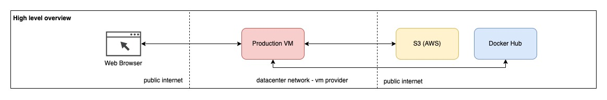
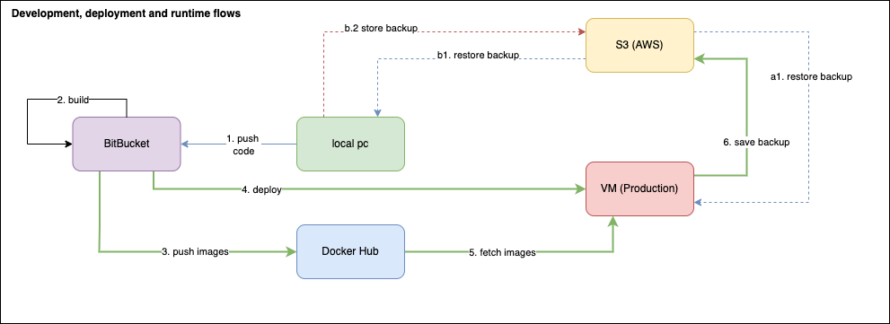

# Conceptual design

## High-Level Overview

High-level architecture is described in the diagram below. 
This architecture was designed with the following constraints in mind:
 - to keep costs at a minimum, while providing a basic infrastructure that will fulfill the needs of small businesses that do not have a lot of users or a personal blog/website.
 - to be open for extension in the future if business grows and to be easy to evolve and scale.
 - to be able to have backups and restore if needed. 
 - to be easy to develop and maintain in the long run. 

We have a production VM hosted in a datacenter. Preferably in the cloud, since most clouds give you free protection solutions like DDOS.
This production VM has connections with:
 - Docker hub to fetch images in order to start containers
 - AWS S3 for backup and restoration

## Inside Production VM
If we zoom in inside the production VM, we will see:

Let's think of VM as a box organized in multiple layers. 
 - Layer 1: The Operating system layer  
   - This layer is preconfigured when you order the VM, so you don't need to do much here. 
   - It's a linux-fedora-35 in my case, but it could be any linux.
 - Layer 2: Docker layer 
   - Docker and Docker compose are installed here. This will provide the infrastructure to run Docker containers. 
   - On this layer we also find docker volumes, that are managed by Docker.
   - Docker compose will talk with DockerHub to download container images.
 - Layer 3: Container layer
   - Webserver container
     - Responsible for the web server and the web application. Inside this container, you will find: OpenLiteSpeed Webserver and PHP installed. 
     - This container also has a Docker volume mounted that contains all website files like html, css, php, js, etc.
     - Since this container also needs a database, it has a connection to the database container.
     - Runs on port 80 and 443
   - Database container
     - It is responsible for the database and comes with MariaDB installed.
     - Has mounted the database volume that contains all the database files.
   - Database Admin UI container
     - Provides a UI to access the database. This is very useful during maintenance and development.
     - Can be disabled in production if not needed
   - Backup Container
     - In charge of backing up the webserver and database volumes to Amazon S3.
     - Has mounted the two volumes: webserver volume, database volume
     - Has cron job, that backups every day at 05:04 am
   - Restore Container
     - In charge of restoring a backup from S3.
     - Not running in production, need to be started manually when is a need for backup restore
     - Connects to S3, retrieves backup files, and overrides files from Docker volumes.

## Development and Deployment Flows
The diagram below describes the development and deployment workflows.
As is the case for most small business there is a single developer who is doing development on his PC. There are no test environments. There is only local and production.

### Development Flow
- Develop and test on local pc.
  - If you already have the website in production, you can test with production data, by using the restore container to restore the last backup from production. This way you are developing on the latest production code and data. 
  - If during the development you added some new data, you can run the backup container locally with backup to dev folder from s3, and then manually trigger restore on production vm, and you will have what you added locally also in production.
- Push code to bitbucket/github

### Deployment Flow
- Deploy to production
  - Use the scripts from cicd folder to deploy to production. 
  - Trigger ansible scripts for deployment to production, either locally or in github/bitbucket pipeline.
  - The scripts will connect with ssh to production vm, and will fetch the new docker images from docker hub, and start them.
  - If during the deployment you also did changes on the database data, or website data, and did a backup from local. You can trigger restore, to get the backup and restore it to production. 
- Test production after deploy

## Future thoughts
### Infrastructure & Scalability
- More production VM can be added, more container instances can be added and scale horizontally.
- However, the docker volume solution will not work anymore. 
  - A proper database in a separate VM, or maybe as a service from a cloud, need to be setup.
  - Webserver volume need to be solved to be accessible by multiple vm and multiple containers.